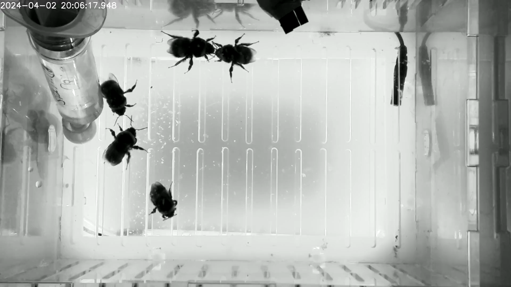
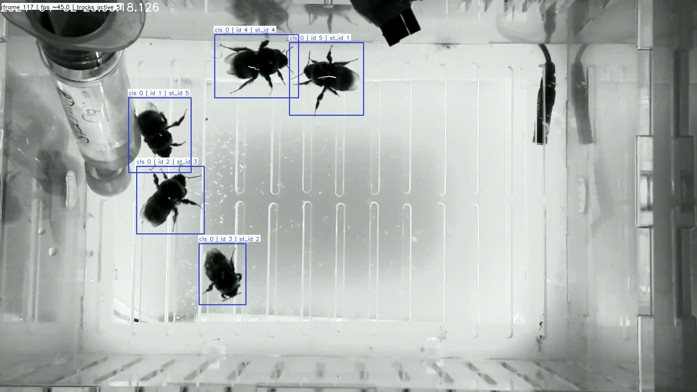

Tracking module
===============

The Tracking module provides end-to-end pipelines for object detection, ID
stabilisation, flow extraction, and analysis. All commands are exposed under
the ``bee track`` CLI group.

Configuration
-------------

To create editable config files in your working directory:

.. code-block:: bash

   bee config init

This writes:

- ``tracking_config.yaml``
- ``tracking/custom_tracker.yaml``

The CLI will automatically use a ``tracking_config.yaml`` in your current
working directory if present.

Commands
--------

Run the full pipeline on a single video file (detection, ID fixing, flow extraction):

.. code-block:: bash

   bee track run-pipeline --input /path/to/video.mp4 --output /path/to/output_dir

Each step in the pipeline can also be run individually:

Run YOLO detection/tracking on a video file and save raw CSV output:

.. code-block:: bash

   bee track run-yolo --model-path /path/to/model.pt --source-video /path/to/video.mp4 \
     --output-path /path/to/out.csv

Fix object IDs across frames on raw tracking CSV data:

.. code-block:: bash

   bee track fix-ids /path/to/tracking.csv --output /path/to/fixed.csv --num-objects 5

Extract flow information (dx/dy/speed) on fixed tracking CSV data:

.. code-block:: bash

   bee track extract-flow /path/to/fixed.csv --output /path/to/flow.csv

In addition, a command is provided to visualise tracking results on a video:

Visualise tracks on video:

.. code-block:: bash

   bee track visualise-tracking --video /path/to/video.mp4 --csv /path/to/fixed.csv \
     --out /path/to/annotated.mp4

Batch processing
----------------

If processing of multiple files is required, a batch-processing command is available. It runs the pipeline
over all videos in a directory tree and writes outputs to per-video subdirectories.

Usage:

.. code-block:: bash

   bee track batch-process --input-dir /path/to/videos

This will create a new directory called ``tracking_outputs`` in the current working directory, with subdirectories for each video containing the outputs.

To specify a different output directory name:

.. code-block:: bash

   bee track batch-process --input-dir /path/to/videos --output-dir-name tracking_outputs

To filter videos by name (e.g. only process videos containing "hiveA" in the filename):

.. code-block:: bash

   bee track batch-process --input-dir /path/to/videos --filter hiveA

Tutorial
--------

This walkthrough uses the test video at ``tests/data/sample_vid.mp4``. This video contains 5 bees and a feeder, and is around 5 seconds long at 45fps:

   Sample frame from ``tests/data/sample_vid.mp4`` around 2.4s.

0) Initialise local config files
~~~~~~~~~~~~~~~~~~~~~~~~~~~~~~~~

Start by generating editable local config files in your working directory. This is optional but recommended if you want to change any defaults such as the model path or number of animals:

.. code-block:: bash

   bee config init

This creates:

- ``tracking_config.yaml``
- ``tracking/custom_tracker.yaml``

``tracking_config.yaml`` contains the main pipeline options you are most likely
to change (model path, confidence threshold, number of tracked objects, and
output CSV naming):

.. literalinclude:: ../src/beehaviourlab/config/tracking_config.yaml
   :language: yaml
   :caption: Default tracking_config.yaml

Common options to edit in ``tracking_config.yaml``:

- ``model_path``: YOLO model file to use for tracking.
- ``conf_threshold``: minimum detection confidence.
- ``num_objects``: expected object count used during ID fixing.
- ``feeder_label``: class ID to treat as feeder.
- ``csv1_name``, ``csv2_name``, ``csv3_name``: output filename suffixes.

``tracking/custom_tracker.yaml`` contains Ultralytics tracker tuning options
such as association thresholds and track buffering.

1) Run the full pipeline (recommended)
~~~~~~~~~~~~~~~~~~~~~~~~~~~~~~~~~~~~~~

This runs detection, ID fixing, and flow extraction in one command:

.. code-block:: bash

   bee track run-pipeline --input tests/data/sample_vid.mp4 --output tutorial_outputs/pipeline

Expected outputs in ``tutorial_outputs/pipeline`` include:

- ``sample_vid_yolo_tracking_raw.csv``
- ``sample_vid_yolo_tracking_fixed_ids.csv``
- ``sample_vid_yolo_tracking_fixed_ids_velocity.csv``

2) Run each step individually
~~~~~~~~~~~~~~~~~~~~~~~~~~~~~

If you want to inspect each stage, run the commands separately.
The YOLO step requires a model path. A model is included in this repository at
``src/beehaviourlab/tracking/model/feeder_bee_YOLO.pt``:

.. code-block:: bash

   bee track run-yolo --model-path src/beehaviourlab/tracking/model/feeder_bee_YOLO.pt \
     --source-video tests/data/sample_vid.mp4 \
     --output-path tutorial_outputs/steps/sample_vid_yolo_tracking_raw.csv

Then fix IDs:

.. code-block:: bash

   bee track fix-ids tutorial_outputs/steps/sample_vid_yolo_tracking_raw.csv \
     --output tutorial_outputs/steps/sample_vid_yolo_tracking_fixed_ids.csv --num-objects 5

Then extract frame by frame velocity and speed metrics:

.. code-block:: bash

   bee track extract-flow tutorial_outputs/steps/sample_vid_yolo_tracking_fixed_ids.csv \
     --output tutorial_outputs/steps/sample_vid_yolo_tracking_fixed_ids_velocity.csv

3) Visualise tracking results
~~~~~~~~~~~~~~~~~~~~~~~~~~~~~

Overlay tracks on the input video using the fixed-ID CSV:

.. code-block:: bash

   bee track visualise-tracking --video tests/data/sample_vid.mp4 \
     --csv tutorial_outputs/steps/sample_vid_yolo_tracking_fixed_ids.csv \
     --out tutorial_outputs/steps/sample_vid_tracked.mp4

Example output frame:

   Visualised output frame around 2.6s with tracked IDs.

